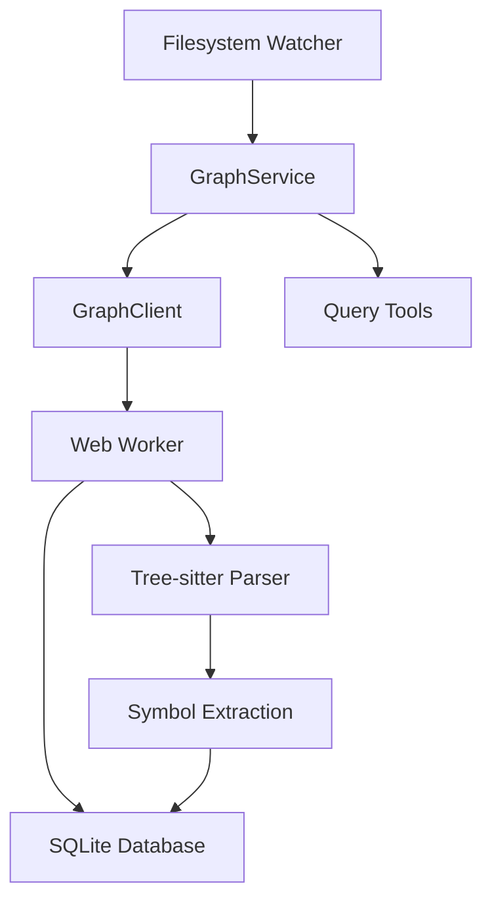

# Graph System Documentation

The graph system provides code structure indexing using tree-sitter and SQLite storage.

## Architecture Overview



## Code Indexing Flow

### 1. Scan Initialization

When `graph.autoScan` is enabled, `GraphService.scan()` is called on plugin startup:

```typescript
async scan(): Promise<void> {
  emitStatus('indexing')
  
  // Prepare scan - collect files and get batch info
  const prepResult = await client.prepareScan()
  
  // Process files in batches
  let offset = 0
  let completed = false
  
  while (!completed) {
    const batchResult = await client.scanBatch(offset, prepResult.batchSize)
    offset = batchResult.nextOffset
    completed = batchResult.completed
    emitStatus('indexing', undefined, `Indexing: ${offset}/${prepResult.totalFiles} files`)
  }
  
  // Finalize - build PageRank, edges, call graph
  await client.finalizeScan()
}
```

### 2. File Processing

Files are processed in batches to allow progress reporting. Each file:

1. Language is detected from extension
2. Tree-sitter parses the file
3. Symbols are extracted (functions, classes, etc.)
4. Imports/exports are identified
5. Call relationships are tracked
6. Results stored in SQLite

### 3. Finalization

After all files are indexed:
- PageRank computed for file importance
- Call graph edges are analyzed
- Co-change patterns are computed
- Barrel file detection runs

## Tree-sitter Integration

### Supported Languages

The graph supports 30+ languages via tree-sitter:

| Category | Languages |
|----------|-----------|
| Web | TypeScript, JavaScript, HTML, CSS, Vue |
| Systems | Rust, C, C++, Go |
| JVM | Java, Kotlin, Scala |
| Scripting | Python, Ruby, PHP, Lua, Elixir, Dart, Zig, Bash |
| Other | Swift, Ruby, OCaml, Objective-C, Solidity, TLA+ |

### Symbol Extraction

For each parsed file, these symbols are extracted:

- `function` / `method` - Function declarations
- `class` / `interface` - Type definitions
- `type` - Type aliases and enums
- `variable` / `constant` - Variable declarations
- `property` - Object properties
- `module` / `namespace` - Module definitions

### Import/Export Tracking

- Import source (module path)
- Import specifiers (imported names)
- Default vs namespace imports
- Export kind (named, default)

## SQLite Schema

### Files Table

```sql
CREATE TABLE files (
  id INTEGER PRIMARY KEY,
  path TEXT UNIQUE,
  mtime_ms REAL,
  language TEXT,
  line_count INTEGER,
  symbol_count INTEGER,
  pagerank REAL,
  is_barrel INTEGER
);
```

### Symbols Table

```sql
CREATE TABLE symbols (
  id INTEGER PRIMARY KEY,
  file_id INTEGER REFERENCES files(id),
  name TEXT,
  kind TEXT,
  line INTEGER,
  end_line INTEGER,
  is_exported INTEGER,
  signature TEXT,
  qualified_name TEXT
);
```

### Relationships

- `imports` - Import relationships between files
- `exports` - Export information per file
- `calls` - Call graph edges between symbols
- `cochanges` - Files that frequently change together

## Query Tools

### graph-status

Check indexing status or trigger re-scan.

```typescript
graph-status { action: "status" | "scan" }
```

### graph-query

File-level graph queries.

```typescript
graph-query { 
  action: "top_files" | "file_deps" | "file_dependents" | "cochanges" | "blast_radius" | "packages" | "file_symbols",
  file?: string,
  limit?: number 
}
```

**Actions:**
- `top_files` - Most important files by PageRank
- `file_deps` - Dependencies of a file
- `file_dependents` - Files depending on this file
- `cochanges` - Files that change together
- `blast_radius` - Files affected if this file changes
- `packages` - External packages used
- `file_symbols` - Symbols defined in file

### graph-symbols

Symbol-level graph queries.

```typescript
graph-symbols { 
  action: "find" | "search" | "signature" | "callers" | "callees",
  name?: string,
  file?: string,
  kind?: string,
  limit?: number 
}
```

**Actions:**
- `find` - Find symbols by exact name
- `search` - Full-text search symbols
- `signature` - Get symbol signature at location
- `callers` - Find who calls this symbol
- `callees` - Find what this symbol calls

### graph-analyze

Code quality analysis.

```typescript
graph-analyze { 
  action: "unused_exports" | "duplication" | "near_duplicates",
  file?: string,
  limit?: number,
  threshold?: number 
}
```

**Actions:**
- `unused_exports` - Find exported but never imported symbols
- `duplication` - Find duplicate code structures
- `near_duplicates` - Find similar but not identical code

## Filesystem Watching

When `graph.watch` is enabled, a filesystem watcher monitors for changes:

1. File change detected
2. Path normalized and validated (ignoredirs, extensions)
3. Change enqueued with debouncing
4. Batch processed after debounce delay
5. Worker re-indexes affected files
6. Stats updated on success

### Ignored Paths

- `.git`, `node_modules`, `dist`, `build`, `target`
- Hidden directories starting with `.`
- Binary file extensions

## Performance Considerations

### Batch Processing

Files are processed in batches (default: 100) to:
- Allow progress reporting
- Prevent memory exhaustion
- Enable incremental updates

### Debouncing

File changes are debounced (default: 500ms) to:
- Batch rapid changes
- Reduce worker load
- Prevent redundant re-indexing

### Web Worker

Indexing runs in a Web Worker to:
- Keep main thread responsive
- Enable parallel processing
- Isolate crash recovery

## Database Location

Graph databases are stored per-project in:

```
{dataDir}/graph/{projectHash}/graph.db
```

Where `projectHash` is derived from project ID and working directory to enable:
- Multiple projects on same machine
- Project-specific graph isolation
- Safe cleanup of old project data
