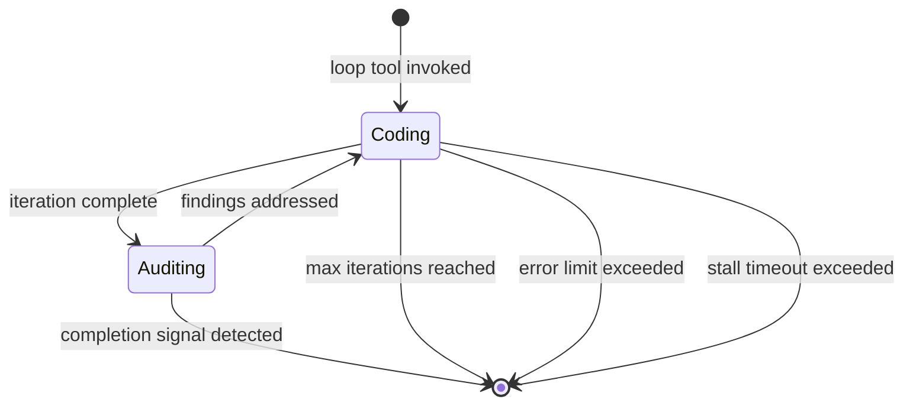
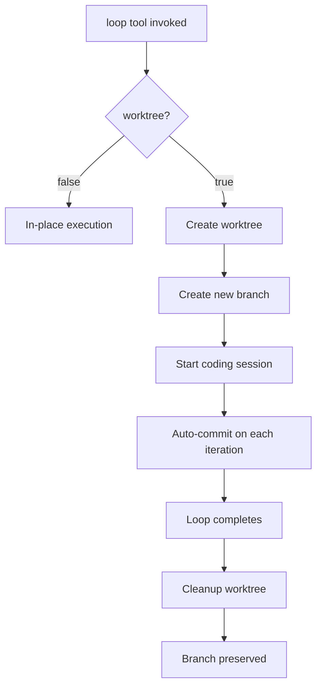

# Loop System Documentation

The loop system provides autonomous iterative development with automatic code auditing.

## Loop Lifecycle



## Loop States

Each loop has a `LoopState` stored in the KV store:

```typescript
interface LoopState {
  active: boolean                    // Whether loop is currently running
  sessionId: string                  // Current OpenCode session ID
  loopName: string                   // Unique loop identifier
  worktreeDir: string                // Worktree path (empty if in-place)
  worktreeBranch?: string            // Branch name if using worktree
  iteration: number                  // Current iteration count
  maxIterations: number              // Maximum iterations (0 = unlimited)
  completionSignal: string | null    // Phrase that signals completion
  startedAt: string                  // ISO timestamp
  prompt?: string                    // Original task prompt
  phase: 'coding' | 'auditing'       // Current phase
  audit?: boolean                    // Whether auditing is enabled
  lastAuditResult?: string           // Last audit output
  errorCount: number                 // Consecutive error count
  auditCount: number                 // Number of audits completed
  terminationReason?: string         // Reason for termination
  completedAt?: string               // ISO timestamp
  worktree?: boolean                 // Whether using worktree isolation
  modelFailed?: boolean              // Whether model error occurred
  sandbox?: boolean                  // Whether using Docker sandbox
  sandboxContainerName?: string      // Container name if sandboxed
}
```

## Session Rotation

Each iteration runs in a **fresh session** to keep context small and prioritize speed:

1. **Coding phase** completes
2. Current session is destroyed
3. New session is created
4. Continuation prompt is injected with:
   - Original task prompt
   - Current iteration number
   - Completion signal instructions
   - Audit findings (if any)

```typescript
function buildContinuationPrompt(state: LoopState, auditFindings?: string): string {
  let systemLine = `Loop iteration ${state.iteration}`

  if (state.completionSignal) {
    systemLine += ` | To stop: output ${state.completionSignal}`
  } else if (state.maxIterations > 0) {
    systemLine += ` / ${state.maxIterations}`
  }

  let prompt = `[${systemLine}]\n\n${state.prompt ?? ''}`

  if (auditFindings) {
    prompt += `\n\n---\nThe code auditor reviewed your changes. You MUST address all bugs and convention violations.`
  }

  return prompt
}
```

## Stall Detection

A watchdog monitors loop activity. If no progress is detected within `stallTimeoutMs` (default: 60 seconds), the current phase is re-triggered.

```typescript
const STALL_TIMEOUT_MS = 60_000
const MAX_CONSECUTIVE_STALLS = 5
```

After 5 consecutive stalls, the loop terminates with `terminationReason: 'stall_timeout'`.

## Review Finding Persistence

Audit findings survive session rotation via the **review store**:

```typescript
interface ReviewFinding {
  file: string
  line: number
  severity: 'bug' | 'warning'
  description: string
  scenario: string
  status: 'open' | 'resolved'
  branch?: string
}
```

At the start of each audit:
1. Existing findings are retrieved via `review-read`
2. Resolved findings are deleted via `review-delete`
3. Unresolved findings are carried forward

Outstanding findings block loop completion until `minAudits` is reached.

## Worktree Isolation

Loops default to in-place execution. Set `worktree: true` for isolated git worktree mode:



Benefits of worktree mode:
- Isolation from ongoing development
- Safe to experiment without affecting main branch
- Branch preserved for later review/merge

## Sandbox Integration

When `sandbox.mode` is `"docker"` and `worktree: true`, loops run inside a Docker container:

1. Container created with worktree mounted at `/workspace`
2. `bash`, `glob`, `grep` tools redirect into container
3. `read`/`write`/`edit` operate on host filesystem
4. Container stopped and removed on loop completion

See [sandbox documentation](#) in architecture.md for details.

## Completion Conditions

A loop completes when ALL of these are true:

1. Code agent outputs the completion signal phrase
2. Minimum audit count (`minAudits`) is reached
3. No outstanding unresolved findings
4. All verification commands in the plan pass (if using plan-execute)

## Cancellation

Loops can be cancelled via:
- `loop-cancel` tool
- `/loop-cancel` slash command
- CLI: `opencode-forge loop cancel <name>`

Cancellation:
1. Marks loop as inactive
2. Sets `terminationReason` to `'cancelled'`
3. Stops sandbox container if applicable
4. Optionally cleans up worktree (if `cleanupWorktree: true`)

## Error Handling

| Error Type | Behavior |
|------------|----------|
| Model error | Automatic fallback to default model, retry |
| 3 consecutive errors | Loop terminates with `terminationReason: 'error'` |
| Stall timeout | Re-trigger current phase, up to 5 times |
| 5 stalls | Loop terminates with `terminationReason: 'stall_timeout'` |

## Tool Restrictions

Inside active loop sessions:
- `git push` is denied (permission hook)
- `loop`, `plan-execute` are blocked (tool hooks)
- `question` is blocked (tool hooks)
